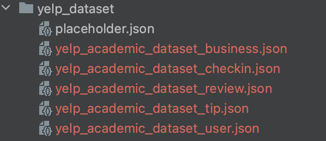

# Restaurant Concierge

## About
__Team Name__: DuoDuo

__Team Members__:

| Name         | NetID    | Email                           |
|--------------|----------|---------------------------------|
| Rhea Chen    | xinyuc11 | xinyuc11@illinois.edu (captian) |
| Jingjing Yao | jyao27   | jyao27@illinois.edu             |
| Xian Chen    | xianc2   | xianc2@illinois.edu             |


## Project Overview
This project aims to develop a simple graphical user interface applicationuser-friendly and 
efficient restaurant concierge service for tourists with limited time in a city. The application 
will address the common pain point of finding the best restaurants during short trips by 
simplifying the search process and providing curated recommendations based on user preferences. 

### Objectives
The existing restaurant apps offer filtering options, they often fall short in:
- __Personalization__: Most apps only allow users to apply one filter at a time
- __Objectivity__: Most platforms prioritize advertising over user experience, displaying sponsored 
  restaurants higher in search results.

We utilize the BM25 algorithm, which ranks restaurants based on reviews that match some positive 
words. This ensures that the top results are consistently good and meet the user's specific 
needs. We hope by providing a user-friendly GUI application, tourists can easily find top-rated 
restaurants that match their location, desired cuisine, and other preferences. 

### Technologies
- __Backend Language__: Python
- __Data Source__: [Yelp Open Dataset](https://www.yelp.com/dataset)
- __BM25 Ranking__: Reviews are analyzed for positive keywords like "excellent" and "delicious". 
  Businesses are ranked based on how well their reviews match these keywords using the BM25 algorithm.

## Usage
### Prerequisite
- __Env requirement__: python 3.10 (3.7 and higher might be fine too)
- __Hardware requirement__: 
  - Intel based (M1/M2 will run into problems opening GUI)
  - Memory 16GB or more (less will result in extra wait time and potential problem loading data/GUI)

### Preparation
- __Download data source__:
  1. Download Yelp's open dataset from [Yelp Open Dataset](https://www.yelp.com/dataset) and extract 
    it (it's a really large file so might take a very long time)
  2. Put all the extrated yelp data files inside the folder `./yelp_dataset/`, do no change file 
     name. Your folder should look like this 
     
- __Install dependencies__: Install required packages by running  
  ```bash
  pip install -r requirements.txt
  ```

### Running
```bash
# CLI
python restaurant_concierge.py

# GUI
python restaurant_concierge_gui.py
```

## Resources
- [Project Final Report](files/CS410%20Final%20Project%20Report%20.pdf)
- [Project Demo Video](https://mediaspace.illinois.edu/media/t/1_x9km4tge)

